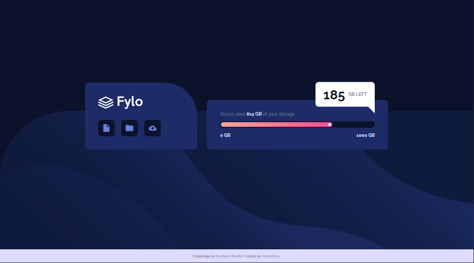
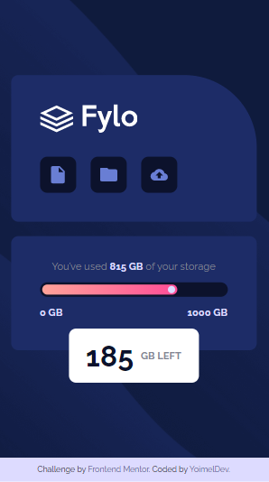

# Frontend Mentor - Fylo data storage component solution

## ✍🏻 Description

[Fylo data storage component challenge on Frontend Mentor](https://www.frontendmentor.io/challenges/fylo-data-storage-component-1dZPRbV5n), where i put into practice my CSS skills, trying to make it as close as possible to the design provided.

## 🎨 Preview

You can see the result here → [Fylo Data Storage component](https://fylo-data-storage-component-yoimeldev.netlify.app/)

    
🖥️ Desktop version

    
📱 Mobile version

## :computer: Technologies

- HTML5
- CSS
- Flexbox
- Mobile-first workflow
